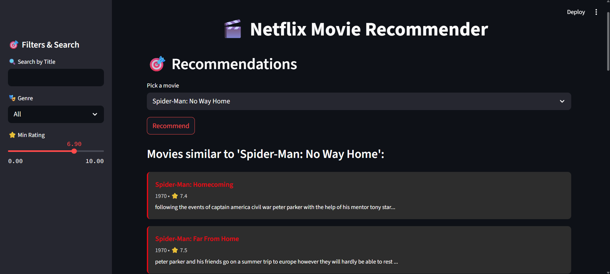

# 🎬 Netflix Movie Recommender

Welcome to the **Netflix Movie Recommender System** — a content-based movie recommendation app built using **Streamlit**, **Pandas**, and **Scikit-learn**.

---

## 📌 Features

- 🔍 **Search by movie title**
- 🎭 **Filter by genre**
- ⭐ **Minimum rating filter**
- 🎯 **Get similar movie recommendations**
- 📊 **View statistics** (Rating distribution, Top genres, etc.)
- 🌙 **Dark-themed modern UI** inspired by Netflix

---

## 📷 Preview

) <!-- You can upload a screenshot to GitHub and paste the link here -->

---

## 🧠 How It Works

This app uses:
- **TF-IDF Vectorization** of movie descriptions + genres
- **Cosine Similarity** to compute similarity between movies
- Filters applied on genre, rating, and search text
- All recommendations update dynamically with Streamlit

---

## 📁 Project Structure
```
netflix-movie-recommender/
│
├── app.py # Main Streamlit app
├── netflix_cleaned.csv # Cleaned movie dataset
├── requirements.txt # Required Python libraries
└── README.md # Project documentation
```

---

## 🛠️ Installation

1. **Clone the repo**  
```bash
git clone https://github.com/Sunaina792/netflix-movie-recommender.git
cd netflix-movie-recommender
```
2. **Install dependencies**
```
Edit
pip install -r requirements.txt
```
3. **Run the app**
```
streamlit run app.py
```

---

## ✅ Requirements
- Python 3.8+

- Streamlit

- Pandas

- Scikit-learn

- Plotly

📌 All listed in requirements.txt

---

👩‍💻 Author
Made with ❤️ by Sunaina
